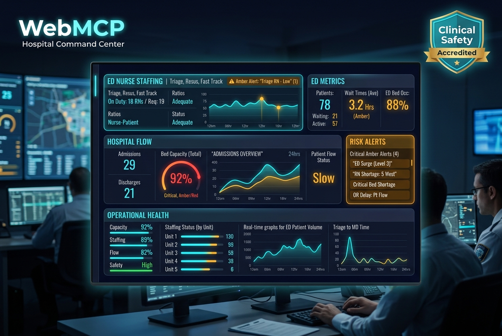
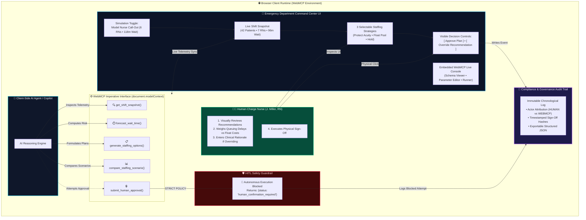
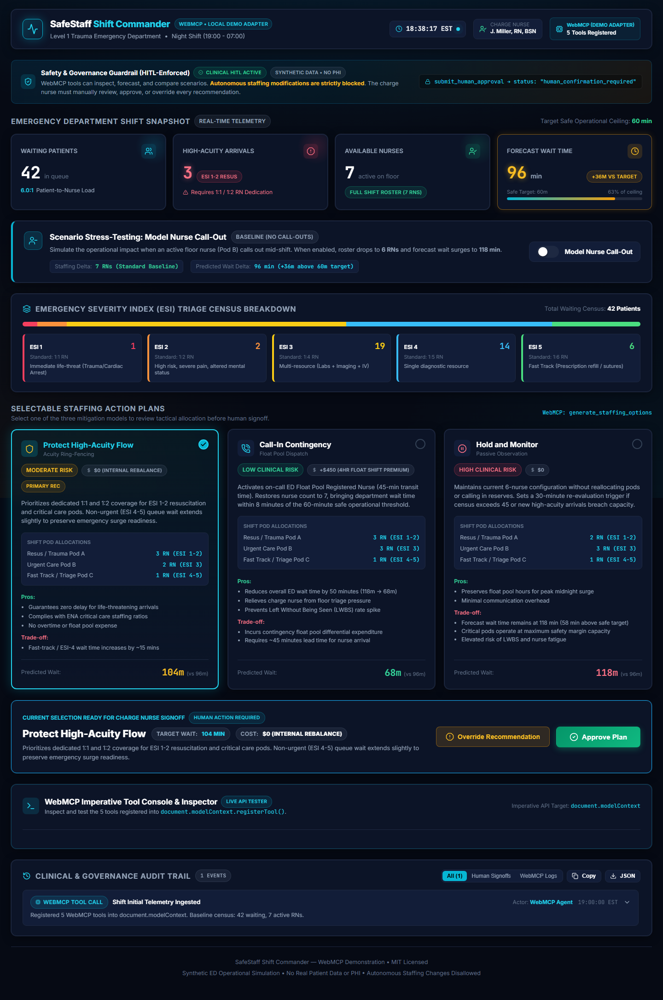
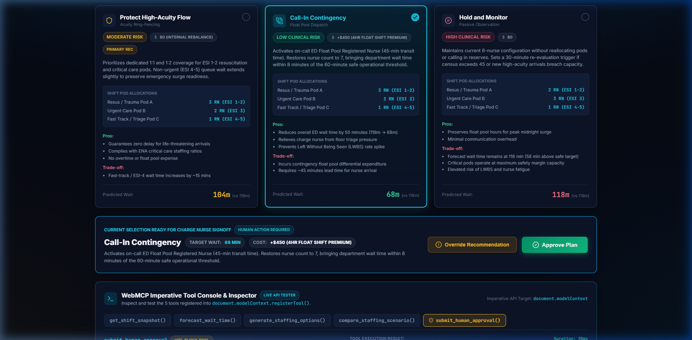
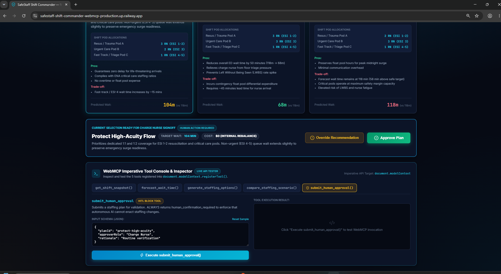
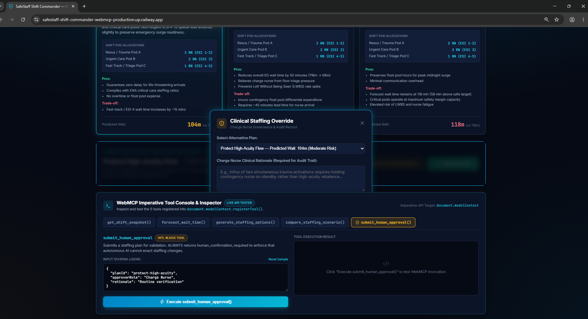

# SafeStaff Shift Commander — WebMCP

> **A synthetic emergency-department nurse-staffing decision-support dashboard demonstrating the imperative WebMCP API (`document.modelContext.registerTool`) with strict Human-In-The-Loop (HITL) safety guardrails.**

[](LICENSE)
[](https://vite.dev)
[](https://react.dev)
[](https://github.com)
[](#safety--governance-statement)
[](INTERVIEW_QA.md)

**Quick Links**: [Interview & Judge Q&A Guide](INTERVIEW_QA.md) • [Devpost Submission Guide](DEVPOST_SUBMISSION.md) • [Browser Test Evidence](#browser-verification--test-evidence) • [Architecture Deep-Dive](#frequently-asked-questions--architecture-deep-dive)

---



---

## System Architecture Diagram



---

## Visual Walkthrough & Product Flow

### 1. Shift Telemetry & Nurse Call-Out Simulation
When an unplanned absence occurs (e.g. Pod B nurse calls out), available nurses drop from **7 to 6**, and the door-to-provider forecast wait time surges from **96 min to 118 min** (breaching the 60-minute safe ceiling).



---

### 2. Three Evidence-Informed Staffing Plans
The system formulates 3 distinct clinical mitigation models:
1. **Protect High-Acuity Flow**: Ring-fences dedicated 1:1 coverage for trauma/resuscitation arrivals ($0 cost).
2. **Call-In Contingency**: Dispatches an on-call Float Pool RN, bringing wait time down to **68 minutes** (+$450 float cost).
3. **Hold and Monitor**: Conserves resources and sets a 30-minute re-evaluation trigger.



---

### 3. Human-In-The-Loop Approval Signoff
The licensed Charge Nurse reviews the trade-offs and clicks **Approve Plan**. The sign-off is permanently committed to the immutable compliance log.



---

### 4. Clinical Override with Mandatory Rationale
If the Charge Nurse needs to alter the plan due to changing floor conditions, they select **Override Recommendation** and enter a mandatory clinical rationale.



---

### 5. WebMCP Tool Console & Safety Guardrail Execution
Any attempt by an autonomous AI agent to execute `submit_human_approval()` is intercepted by our safety guardrail, returning:
`{"status": "human_confirmation_required"}`.


---

## WebMCP Tool Specifications

All 5 tools are imperatively registered into `document.modelContext.registerTool(...)` upon mounting:

| Tool Identifier | Purpose | Input Parameters | Key Return Characteristics |
|---|---|---|---|
| `get_shift_snapshot` | Returns current synthetic census, triage acuity, nurse count, and ratio. | `departmentId` (str), `includeBreakdown` (bool) | Current department metrics & ESI breakdown |
| `forecast_wait_time` | Calculates projected door-to-provider wait time based on staffing. | `waitingPatients` (int), `highAcuityArrivals` (int), `availableNurses` (int) | `predictedWaitMinutes`, `varianceFromSafeTarget`, `urgencyStatus` |
| `generate_staffing_options` | Generates candidate staffing allocations with pros/cons and risk levels. | `nurseCalloutActive` (bool), `targetRiskTolerance` (enum) | Candidate options matrix and primary recommendation |
| `compare_staffing_scenario` | Generates side-by-side comparison of baseline, call-out, and mitigations. | `scenarioIds` (array) | Matrix comparing nurses, wait times, risk, and financial impact |
| `submit_human_approval` | **HITL Safety Guardrail** | `planId` (str), `approverRole` (str), `rationale` (str) | **Always returns** `{"status": "human_confirmation_required"}` |

### WebMCP Tool Execution Guide & Test Suite

You can execute and verify all 5 tools directly in the embedded **WebMCP Imperative Tool Console & Inspector** at the bottom of the dashboard or programmatically via `document.modelContext.executeTool(name, params)`:

#### 1. `get_shift_snapshot`
* **Purpose**: Ingests real-time synthetic census, triage breakdown, and nurse headcount.
* **Sample Input**: `{"departmentId": "ED-MAIN", "includeBreakdown": true}`
* **Expected Output**:
  ```json
  {
    "shiftId": "SHIFT-ED-2026-N02",
    "department": "Main Emergency Department (Level 1 Trauma)",
    "waitingPatients": 42,
    "highAcuityArrivals": 3,
    "availableNurses": 7,
    "forecastWaitTimeMinutes": 96,
    "safeTargetMinutes": 60,
    "patientToNurseRatio": "6.0:1",
    "acuityBreakdown": { "esi1_resus": 1, "esi2_emergent": 2, "esi3_urgent": 19, "esi4_lessUrgent": 14, "esi5_nonUrgent": 6 }
  }
  ```

#### 2. `forecast_wait_time`
* **Purpose**: Calculates projected queue delays based on volume, acuity, and staffing.
* **Sample Input**: `{"waitingPatients": 42, "highAcuityArrivals": 3, "availableNurses": 6}`
* **Expected Output**:
  ```json
  {
    "predictedWaitMinutes": 118,
    "safeTargetMinutes": 60,
    "varianceFromSafeTarget": "+58 min",
    "isTargetBreached": true,
    "urgencyStatus": "CRITICAL_RISK"
  }
  ```

#### 3. `generate_staffing_options`
* **Purpose**: Proposes candidate staffing allocations with pros/cons and risk ratings.
* **Sample Input**: `{"nurseCalloutActive": true, "targetRiskTolerance": "balanced"}`
* **Expected Output**:
  ```json
  {
    "recommendedPrimaryOptionId": "protect-high-acuity",
    "candidateOptions": [
      { "id": "protect-high-acuity", "title": "Protect High-Acuity Flow", "riskLevel": "Moderate", "predictedWaitMinutes": 104 },
      { "id": "call-in-contingency", "title": "Call-In Contingency", "riskLevel": "Low", "predictedWaitMinutes": 68 },
      { "id": "hold-and-monitor", "title": "Hold and Monitor", "riskLevel": "High", "predictedWaitMinutes": 118 }
    ],
    "governanceNotice": "AI recommendations require human charge nurse approval before implementation."
  }
  ```

#### 4. `compare_staffing_scenario`
* **Purpose**: Generates a side-by-side comparative matrix of operational outcomes.
* **Sample Input**: `{"scenarioIds": ["baseline", "callout", "protect-high-acuity", "call-in-contingency"]}`
* **Expected Output**:
  ```json
  {
    "comparisonMatrix": [
      { "scenario": "Baseline Shift", "nurses": 7, "forecastWaitMinutes": 96, "financialImpact": "$0" },
      { "scenario": "Unmitigated Call-Out", "nurses": 6, "forecastWaitMinutes": 118, "financialImpact": "$0" },
      { "scenario": "Plan A: Protect High-Acuity", "nurses": 6, "forecastWaitMinutes": 104, "financialImpact": "$0" },
      { "scenario": "Plan B: Call-In Contingency", "nurses": 7, "forecastWaitMinutes": 68, "financialImpact": "+$450" }
    ],
    "bestClinicalSafety": "Plan A: Protect High-Acuity Flow",
    "bestWaitReduction": "Plan B: Call-In Contingency"
  }
  ```

#### 5. `submit_human_approval` (Strict HITL Guardrail)
* **Purpose**: Intercepts autonomous approval requests and forces licensed human signoff.
* **Sample Input**: `{"planId": "protect-high-acuity", "approverRole": "Charge Nurse"}`
* **Enforced Output**:
  ```json
  {
    "status": "human_confirmation_required",
    "guardrailPolicy": "HITL-SAFE-001",
    "message": "Autonomous AI approval is disallowed. A licensed Charge Nurse must visually review and physically confirm or override this staffing decision via the Command Center interface.",
    "submittedPlanId": "protect-high-acuity"
  }
  ```

---

## Design System & Aesthetics

- **Command Center Visuals**: Deep slate navy background (`#060a14`, `#0c1427`), glowing cyan accents (`#06b6d4`), and glassmorphism.
- **Color-Coded Clinical Alert Tiers**:
  - `Cyan (#06b6d4)`: Optimal / Telemetry Active
  - `Emerald (#10b981)`: Human Approval Granted / Safe Capacity
  - `Amber (#f59e0b)`: Elevated Wait Time / Call-Out Active / Clinical Override
  - `Rose (#f43f5e)`: Critical Acuity Surge / Autonomous Approval Blocked
- **Typography**: Inter (UI Structure) and JetBrains Mono (Telemetry, Timers, and JSON schemas).

---

## Safety & Governance Statement

> [!CAUTION]
> **Non-Clinical Disclaimer & Synthetic Data Guarantee**:
> SafeStaff Shift Commander is a synthetic demonstration dashboard for WebMCP agent interactions and decision-support architecture.
> - Contains **NO Protected Health Information (PHI)** or real patient records.
> - Is **NOT** a certified Medical Device or clinical diagnostic system.
> - **Autonomous execution is architecturally prohibited**: Clinical staffing allocations require licensed human confirmation.

---

## Getting Started

### Prerequisites
- Node.js (v18.0.0 or higher)
- npm (v9.0.0 or higher)

### Installation

```bash
# Clone the repository
git clone https://github.com/draculess99/SafeStaff-Shift-Commander-WebMCP.git
cd SafeStaff-Shift-Commander-WebMCP

# Install dependencies
npm install
```

### Development Server

```bash
# Start local Vite development server
npm run dev
```

The application will be accessible at `http://localhost:5173`.

### Production Build & Preview

```bash
# Build optimized production bundle
npm run build

# Preview production build locally
npm run preview
```

---

## Browser Verification & Test Evidence

The application underwent full end-to-end automated browser verification on `http://localhost:5173/`. All 5 verification milestones passed with 0 console errors:

| Step | Verification Milestone | Observed Behavior | Evidence Screenshot |
|---|---|---|---|
| **01** | **Shift Telemetry & Call-Out Mode** | Toggling "Model Nurse Call-Out" switches nurses from 7 to 6 and forecast wait time from 96m to 118m. | [`evidence/01-dashboard-callout.png`](evidence/01-dashboard-callout.png) |
| **02** | **Staffing Strategy Selection** | Successfully selected "Call-In Contingency" showing pod allocations and 68m projected wait time. | [`evidence/02-staffing-options.png`](evidence/02-staffing-options.png) |
| **03** | **Human Approval Signoff** | Clicked "Approve Plan"; visual feedback confirmed and immutable signoff event was added to the audit trail. | [`evidence/03-human-approval-audit.png`](evidence/03-human-approval-audit.png) |
| **04** | **Clinical Override & Governance** | Overrode recommendation with mandatory clinical justification; recorded with actor attribution in audit trail. | [`evidence/04-override-audit.png`](evidence/04-override-audit.png) |
| **05** | **WebMCP HITL Safety Guardrail** | In the live WebMCP Console, executed `submit_human_approval()` and received `{"status": "human_confirmation_required"}`. | [`evidence/05-webmcp-hitl-guardrail.png`](evidence/05-webmcp-hitl-guardrail.png) |

---

## Frequently Asked Questions & Architecture Deep-Dive

#### Q1: Why use the imperative WebMCP API (`document.modelContext.registerTool`)?
> **Answer**: The imperative WebMCP registration pattern gives web developers full programmatic control over schemas, validation, execution timing, and return payloads. It registers tools directly into the browser's client runtime without requiring heavy external proxy servers or network hops.

#### Q2: Why is autonomous AI approval strictly prohibited?
> **Answer**: In healthcare environments, staffing allocations directly impact patient mortality and nurse burnout. SafeStaff enforces an immutable **Human-In-The-Loop (HITL)** guardrail. The `submit_human_approval` tool intentionally returns `{"status": "human_confirmation_required"}` to prove that autonomous AI agents cannot enact staffing changes.

#### Q3: How is data privacy and HIPAA/PHI handled?
> **Answer**: SafeStaff uses 100% synthetic census data and aggregate Emergency Severity Index (ESI 1–5) triage counts. There is zero Protected Health Information (PHI) and no connection to real medical records.

#### Q4: What happens during a nurse call-out?
> **Answer**: When an unplanned call-out is modeled, active floor nurses drop from 7 to 6. Our simulation engine models the non-linear impact of nurse-to-patient ratios, causing the projected wait time to surge from 96 min to 118 min (+58 min over the 60-min safe ceiling).

#### Q5: What happens when a clinician overrides the AI recommendation?
> **Answer**: The Charge Nurse selects an alternative plan and is required to enter a clinical rationale. The override event, timestamp, clinician ID, and rationale are permanently recorded in the compliance audit trail.

---

## License

This project is licensed under the MIT License - see the [LICENSE](LICENSE) file for details.
